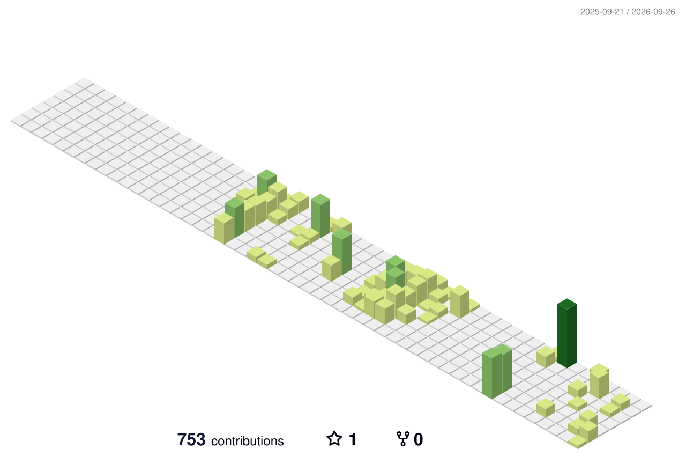

  
  
   
  

 

  <h2>🧑‍💻 Contact Me 🧑‍💻</h2>
  
  
  
  
  

    
  <h3>📧 Email</h3>
  
<strong>이메일_주소를_입력해주세요@gmail.com</strong>

 

  <h2>✨ Tech Stack ✨</h2>
  
  <h3>Frontend</h3>
  
  
  
  
  
   
  
  <h3>Backend</h3>
  
  
  
  
  

   

  <h3>Tools</h3>
  
  
  

 

  <h2>🥇 Baekjoon Tier 🥇</h2>
  

 

  <h2>📋 Stats & Trophies 📋</h2>
  
  
    
  

 

  <h2>🟩 3D Contribution Graph 🟩</h2>
  

 

---

  

